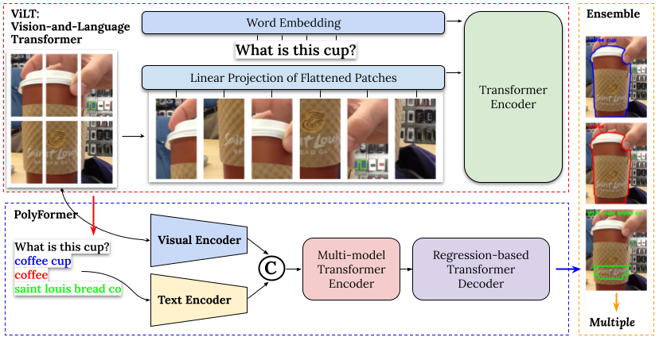

# Vision-Language Model-based PolyFormer for Recognizing Visual Questions with Multiple Answer Groundings

## Introduction 
This paper presents a new method that utilizes the capabilities of Vision-and-Language Transformers (ViLT) and the advanced PolyFormer model to tackle the Single Answer Grounding Challenge in the VQA-Therapy dataset. The initial step of our approach involves employing the ViLT model to predict the possible count of unique responses by considering the input question and image. The PolyFormer model subsequently examines the output from ViLT in conjunction with the image to produce visual answer masks that correspond to the input. The presence of overlap between these masks determines whether the answers have a common grounding. If there is no overlap, it indicates the existence of multiple groundings. Our approach achieved an F1 score of 81.71 on the test-dev set and 80.72 on the VizWiz Grand Challenge test set, positioning our team among the Top3 submissions in the competition.

## Proposed Approach

## Installation
Here is the list of libraries used in this project:
- [ViLT](https://github.com/dandelin/ViLT/tree/762fd3975c180db6fc88f577cf39549983fa373a)
- [PolyFormer](https://github.com/amazon-science/polygon-transformer)

## Inference
- Download test set from [VQA-AnswerTherapy](https://vizwiz.org/tasks-and-datasets/vqa-answer-therapy/)
- Fine-tune the ViLT model on the VQA-AnswerTherapy dataset
- Download pretrained [PolyFormer-L](https://drive.google.com/file/d/1lUCv7dUPctEz4vEpPr7aI8A8ZmfYCB8y/view?usp=share_link)
- Inference VizWiz Grand Challenge test set using [inference_VizWiz](./src/inference_VizWiz.py)
## Contact
If you have any questions, please feel free to contact Dai Tran [(daitran@skku.edu)](daitran@skku.edu).

